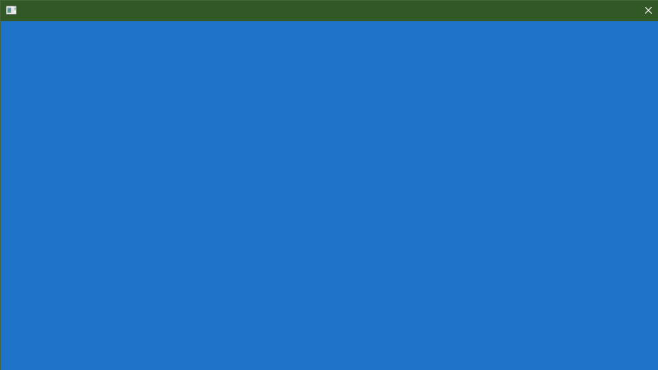
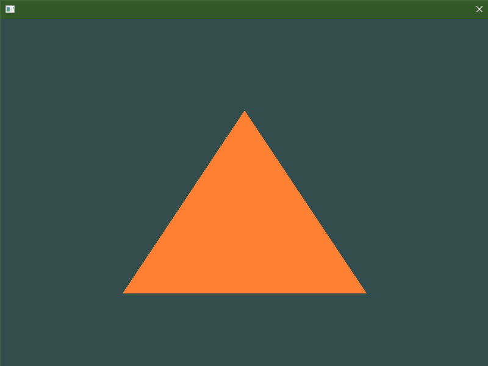

# jo/app

A stupidly easy to use alternative to SDL, GLFW, Raylib, and others.

```odin
package app_example

import "jo:app"
import "core:image/png"
import "core:mem"

main :: proc() {
	app.init()
	
	bitmap := make([]u32, app.width() * app.height())
	awesomeface, _ := png.load("awesomeface.png")

	pos: [2]f32 = ---
	pos.x = f32((app.width() - awesomeface.width) / 2)
	pos.y = f32((app.height() - awesomeface.height) / 2)
	
	for !app.should_close() {
        if app.key_pressed(.Escape) do return
		mem.zero_slice(bitmap)

		if app.gamepad_connected(0) {
			pos += app.gamepad_left_stick(0)
		} else {
			if app.key_down(.Left)  do pos.x -= 1
			if app.key_down(.Right) do pos.x += 1
			if app.key_down(.Down)  do pos.y -= 1
			if app.key_down(.Up)	do pos.y += 1
		}
		pos.x = clamp(pos.x, 0, f32(app.width()-1-awesomeface.width))
		pos.y = clamp(pos.y, 0, f32(app.height()-1-awesomeface.height))

		draw_image(bitmap, awesomeface, pos)

        app.render(bitmap)
	}
}

image_pixel :: proc(img: ^png.Image, x, y: int) -> u32 {
	reversed_y := img.height - y - 1
	i := (x+reversed_y*img.width) * 4
	pixel: [4]byte = ---
	copy(pixel[:], img.pixels.buf[i:i+4])
	return transmute(u32)pixel
}

draw_pixel :: proc(bitmap: []u32, x, y: int, pixel: u32) {
	bitmap[x+y*app.width()] = pixel
}

draw_image :: proc(bitmap: []u32, img: ^png.Image, pos: [2]f32) {
	x := int(pos.x)
	y := int(pos.y)
	for image_x := 0; image_x < img.width && image_x < app.width(); image_x += 1 {
		for image_y := 0; image_y < img.height && image_y < app.height(); image_y += 1 {
			pixel := image_pixel(img, image_x, image_y)
			draw_pixel(bitmap, x + image_x, y + image_y, pixel)
		}
	}
}
```


You can also create an OpenGL context with just one procedure call:

```odin
package app_gl_example

import "jo:app"
import gl "vendor:OpenGL"

main :: proc() {
	app.init()
	app.gl_init(4, 6)

	for !app.should_close() {
        if app.key_pressed(.Escape) do return

		gl.ClearColor(0.123, 0.456, 0.789, 1)
		gl.Clear(gl.COLOR_BUFFER_BIT)
		app.gl_swap_buffers()
	}
}
```



## Why another library?

Libraries like SDL, GLFW, Raylib, Sokol, and others aren't good enough for me. 

So far, these are the principles I've been running with when developing jo/app:

1. Flexibility isn't always good. Most programs don't need multiple windows, for example. Strategic *inflexibility* can make a library much nicer to use in 99% of cases.
2. Reduce the number of *necessary* API calls as much as possible.
3. Avoid returning results. Most errors in platform specific code are just that: *errors*. If they happen, it means there's something wrong with the *library*. Where this isn't the case, such as with `app.gl_init`, a boolean result is acceptable. If it fails, it simply means that version of OpenGL isn't present on the user's machine.
4. NEVER EVER make a procedure like `app.get_last_error`. If the library is being used in a blatantly incorrect way, it should panic with a useful error message. Forcing the user to get an error and print it out themsevles is completely pointless.

# jo/ngl

A stupidly easy to use wrapper over OpenGL 4.6.

```odin
package ngl_hello_triangle

import "jo:app"
import gl "jo:ngl"
import "core:slice"

main :: proc() {
	app.init(width = 800, height = 600)
	app.gl_init(4, 6)

	vertex_shader := gl.create_shader("vert.spv", .Vertex)
	fragment_shader := gl.create_shader("frag.spv", .Fragment)
	program := gl.create_program(vertex_shader, fragment_shader)

	vertices := [?]f32{
		-0.5, -0.5, 0.0, // left  
		0.5, -0.5, 0.0, // right 
		0.0,  0.5, 0.0, // top   
	};

	vertex_buffer := gl.create_buffer()
	gl.buffer_data(vertex_buffer, slice.to_bytes(vertices[:]), .Static_Draw)

	vertex_array := gl.create_vertex_array()
	gl.bind_vertex_buffer_to_vertex_array(vertex_array, 0, vertex_buffer, 0, size_of(f32) * 3)
	gl.enable_vertex_array_attrib(vertex_array, 0)
	gl.vertex_array_attrib_format(vertex_array, 0, 3, f32, false, 0)
	gl.vertex_array_attrib_binding(vertex_array, 0, 0)
	
	for !app.should_close() {
		if app.key_pressed(.Escape) do return

		gl.clear_color(0.2, 0.3, 0.3, 1.0)
		gl.clear({.Color})

		gl.use_program(program)
		gl.bind_vertex_array(vertex_array)
		gl.draw_arrays(.Triangles, 0, 3)

		app.gl_swap_buffers()
	}
}
```



## Why wrap over OpenGL? Why not just use it directly?

OpenGL 4.6 is great; unfortunately, there isn't a 500 page book on how to use it, and it isn't at all clear which procedures it deprecates and which procedures it keeps. jo/ngl bans the "deprecated" procedures by simply not providing wrappers over them. This way, you have no choice but to use the procedures you actually want.

# IMPORTANT:

jo is still early in development. For now, it is Windows only.

Also gdr isn't a library, it's just me trying to learn Vulkan.